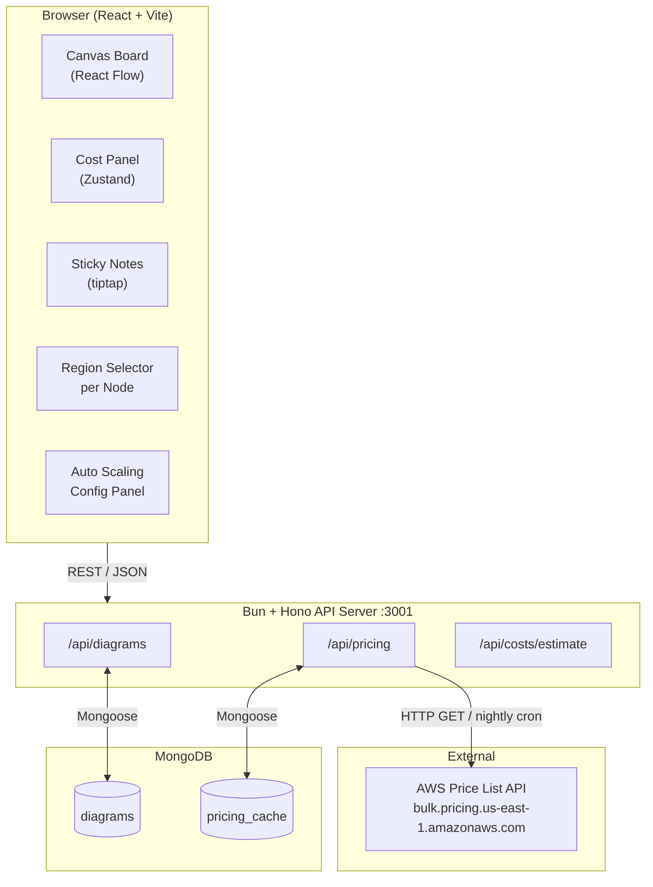
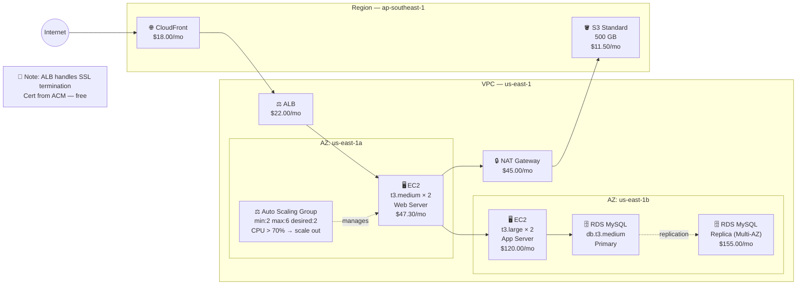
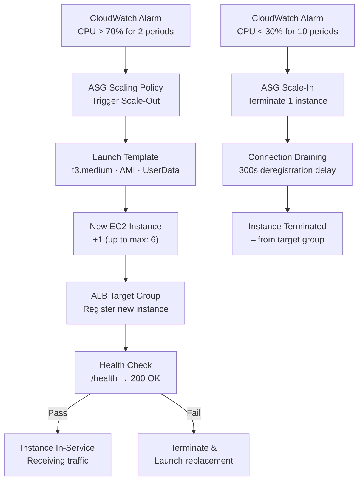

# AWS Infra Canvas — Holori Clone

> Interactive AWS infrastructure diagram canvas with real-time cost estimation, sticky notes, and MongoDB persistence.

---

## Table of Contents

1. [Overview](#overview)
2. [Tech Stack](#tech-stack)
3. [Features](#features)
4. [System Architecture Diagram](#system-architecture-diagram)
5. [Canvas Architecture Diagram](#canvas-architecture-diagram)
6. [Project Structure](#project-structure)
7. [Data Models](#data-models)
8. [Per-Node Region Selection](#per-node-region-selection)
9. [Auto Scaling Configuration](#auto-scaling-configuration)
10. [API Reference](#api-reference)
11. [Frontend Components](#frontend-components)
12. [Cost Engine](#cost-engine)
13. [AWS Services Supported](#aws-services-supported)
14. [Getting Started](#getting-started)
15. [Environment Variables](#environment-variables)
16. [Roadmap](#roadmap)

---

## Overview

AWS Infra Canvas lets you drag-and-drop AWS service nodes onto an infinite canvas, connect them with data-flow edges, and instantly see **monthly / yearly / reserved** cost breakdowns per service and for the entire architecture. Sticky notes let you annotate any part of the diagram.

---

## Tech Stack

| Layer       | Technology                                                           |
|-------------|----------------------------------------------------------------------|
| Runtime     | **Bun** (server + scripts)                                           |
| Frontend    | **React 18** + **TypeScript**                                        |
| Canvas      | **React Flow** (`@xyflow/react`)                                     |
| Styling     | **Tailwind CSS** + **shadcn/ui**                                     |
| State       | **Zustand**                                                          |
| Backend API | **Bun HTTP** (native) or **Hono** (lightweight framework on Bun)    |
| Database    | **MongoDB** via **Mongoose**                                         |
| Auth        | **JWT** (optional, Phase 2)                                          |
| Build       | **Vite** (frontend)                                                  |
| Monorepo    | Workspace managed by `bun workspaces`                               |

---

## Features

### Canvas
- Infinite drag-and-drop canvas powered by React Flow
- AWS service nodes (EC2, S3, RDS, VPC, Lambda, ELB, CloudFront, etc.)
- **Per-node region selection** — each node can be in a different AWS region; color-coded borders distinguish regions
- **Auto Scaling Group config** — min / desired / max capacity + scaling policy (CPU, memory, request-based, scheduled)
- Edge connections representing data transfer between services
- Cross-region edges auto-detect and apply inter-region transfer pricing with a cost warning
- Group / region containers (VPC subnets, AZs)
- ASG container node wraps EC2 instances sharing a scaling group
- Minimap + zoom controls
- Auto-layout option

### Cost Engine
- **EC2**: On-demand, Reserved (1yr / 3yr), Spot pricing per instance type + region
- **S3**: Storage (GB), GET/PUT requests, data transfer out
- **RDS**: Instance class, Multi-AZ, storage, I/O
- **Data Transfer**: Between services, across AZs, internet egress
- **Lambda**: Invocations + GB-seconds
- **VPC**: NAT Gateway hours + data processed, VPN connections
- **CloudFront**: Data transfer + requests
- Cost view toggle: **Monthly** | **Yearly** | **3-Year Reserved**
- Per-node cost badge on canvas
- Side panel: cost breakdown table with % contribution per service
- Total cost summary card

### Sticky Notes
- Add sticky note anywhere on the canvas
- Rich-text (bold, italic, bullet list) via `tiptap`
- Color picker (7 colors)
- Resize + reposition
- Linked to a node (optional) — shown as an annotation pin

### Persistence
- Save/load canvas to MongoDB
- Multiple named diagrams per workspace
- Auto-save every 30 seconds
- Version history (last 10 snapshots)
- Export as PNG / JSON

---

## System Architecture Diagram



---

## Canvas Architecture Diagram



---

## Architecture

```
┌─────────────────────────────────────────────────────┐
│                     Browser                         │
│  ┌──────────┐  ┌─────────────┐  ┌───────────────┐  │
│  │  Canvas  │  │ Cost Panel  │  │ Sticky Notes  │  │
│  │(ReactFlow│  │  (Zustand)  │  │   (tiptap)    │  │
│  └────┬─────┘  └──────┬──────┘  └───────┬───────┘  │
│       └───────────────┴─────────────────┘           │
│                    React App (Vite)                  │
└──────────────────────┬──────────────────────────────┘
                       │ REST / JSON
┌──────────────────────▼──────────────────────────────┐
│              Bun + Hono API Server                   │
│  /api/diagrams   /api/costs   /api/pricing           │
└──────────────────────┬──────────────────────────────┘
                       │ Mongoose
┌──────────────────────▼──────────────────────────────┐
│                   MongoDB                            │
│  diagrams   pricing_cache   users(phase2)            │
└─────────────────────────────────────────────────────┘
```

---

## Project Structure

```
aws-infra-canvas/
├── apps/
│   ├── web/                        # React + Vite frontend
│   │   ├── src/
│   │   │   ├── components/
│   │   │   │   ├── canvas/
│   │   │   │   │   ├── CanvasBoard.tsx        # Main React Flow wrapper
│   │   │   │   │   ├── nodes/
│   │   │   │   │   │   ├── EC2Node.tsx
│   │   │   │   │   │   ├── S3Node.tsx
│   │   │   │   │   │   ├── RDSNode.tsx
│   │   │   │   │   │   ├── VPCNode.tsx
│   │   │   │   │   │   ├── LambdaNode.tsx
│   │   │   │   │   │   ├── ELBNode.tsx
│   │   │   │   │   │   ├── CloudFrontNode.tsx
│   │   │   │   │   │   └── StickyNoteNode.tsx
│   │   │   │   │   ├── edges/
│   │   │   │   │   │   └── DataTransferEdge.tsx
│   │   │   │   │   └── controls/
│   │   │   │   │       ├── Toolbar.tsx        # Service palette
│   │   │   │   │       └── RegionSelector.tsx
│   │   │   │   ├── cost/
│   │   │   │   │   ├── CostPanel.tsx          # Right sidebar
│   │   │   │   │   ├── CostBadge.tsx          # Per-node cost overlay
│   │   │   │   │   ├── CostBreakdownTable.tsx
│   │   │   │   │   └── CostSummaryCard.tsx
│   │   │   │   └── ui/                        # shadcn/ui primitives
│   │   │   ├── store/
│   │   │   │   ├── canvasStore.ts             # Nodes + edges state
│   │   │   │   ├── costStore.ts               # Computed costs
│   │   │   │   └── diagramStore.ts            # Save/load
│   │   │   ├── hooks/
│   │   │   │   ├── useCostCalculator.ts
│   │   │   │   └── useAutoSave.ts
│   │   │   ├── lib/
│   │   │   │   ├── costEngine/
│   │   │   │   │   ├── index.ts               # Entry point
│   │   │   │   │   ├── ec2.ts
│   │   │   │   │   ├── s3.ts
│   │   │   │   │   ├── rds.ts
│   │   │   │   │   ├── dataTransfer.ts
│   │   │   │   │   ├── lambda.ts
│   │   │   │   │   └── vpc.ts
│   │   │   │   └── awsIcons.ts                # SVG icon map
│   │   │   ├── types/
│   │   │   │   ├── nodes.ts
│   │   │   │   ├── costs.ts
│   │   │   │   └── diagram.ts
│   │   │   ├── App.tsx
│   │   │   └── main.tsx
│   │   ├── index.html
│   │   ├── vite.config.ts
│   │   └── package.json
│   │
│   └── server/                     # Bun + Hono API
│       ├── src/
│       │   ├── routes/
│       │   │   ├── diagrams.ts
│       │   │   └── pricing.ts
│       │   ├── models/
│       │   │   ├── Diagram.ts
│       │   │   └── PricingCache.ts
│       │   ├── services/
│       │   │   └── pricingSync.ts  # Pulls AWS price list JSON
│       │   ├── db.ts               # Mongoose connect
│       │   └── index.ts            # Hono app entry
│       └── package.json
│
├── packages/
│   └── shared/                     # Shared TS types
│       ├── src/
│       │   ├── types.ts
│       │   └── constants.ts
│       └── package.json
│
├── package.json                    # Bun workspace root
├── bun.lockb
└── .env.example
```

---

## Data Models

### `Diagram` (MongoDB)

```typescript
interface Diagram {
  _id: ObjectId;
  name: string;
  description?: string;
  region: string;                    // e.g. "us-east-1"
  nodes: CanvasNode[];               // React Flow nodes
  edges: CanvasEdge[];               // React Flow edges
  stickyNotes: StickyNote[];
  costSettings: {
    billingModel: 'ondemand' | 'reserved1yr' | 'reserved3yr' | 'spot';
    currency: 'USD';
  };
  snapshots: Snapshot[];             // last 10 auto-saves
  createdAt: Date;
  updatedAt: Date;
}
```

### `CanvasNode`

```typescript
interface CanvasNode {
  id: string;
  type: AWSServiceType;              // 'ec2' | 's3' | 'rds' | 'vpc' | ...
  position: { x: number; y: number };
  data: {
    label: string;
    config: EC2Config | S3Config | RDSConfig | ...;
    costOverride?: number;           // manual override in USD/month
  };
}
```

### `EC2Config`

```typescript
interface EC2Config {
  instanceType: string;              // e.g. "t3.medium"
  count: number;
  operatingSystem: 'Linux' | 'Windows' | 'RHEL';
  utilizationHours: number;          // per month, default 730
  ebsVolumeGb: number;
  ebsType: 'gp3' | 'gp2' | 'io1' | 'st1' | 'sc1';
}
```

### `S3Config`

```typescript
interface S3Config {
  storageGb: number;
  storageClass: 'Standard' | 'IntelligentTiering' | 'Glacier' | 'GlacierDeepArchive';
  getRequests: number;               // per month
  putRequests: number;               // per month
  dataTransferOutGb: number;
}
```

### `RDSConfig`

```typescript
interface RDSConfig {
  engine: 'mysql' | 'postgres' | 'aurora-mysql' | 'aurora-postgres' | 'sqlserver';
  instanceClass: string;             // e.g. "db.t3.medium"
  multiAz: boolean;
  storageGb: number;
  storageType: 'gp2' | 'gp3' | 'io1';
  iops?: number;
}
```

### `StickyNote`

```typescript
interface StickyNote {
  id: string;
  position: { x: number; y: number };
  size: { width: number; height: number };
  color: string;                     // hex
  content: string;                   // tiptap JSON string
  linkedNodeId?: string;
  zIndex: number;
}
```

---

## Per-Node Region Selection

Every node on the canvas carries its own `region` field — independent of the diagram-level default region. This allows multi-region architectures on a single canvas.

### How it works

1. **Default region** — set at diagram level (e.g. `us-east-1`). New nodes inherit it.
2. **Override per node** — click any node → gear icon → Region dropdown → pick any AWS region. The node border color changes to indicate it differs from the default.
3. **Cost impact** — pricing is fetched per region from the pricing cache. A cross-region data transfer edge automatically detects region mismatch and applies inter-region rates.

### Supported Regions

```
us-east-1       US East (N. Virginia)
us-east-2       US East (Ohio)
us-west-1       US West (N. California)
us-west-2       US West (Oregon)
eu-west-1       Europe (Ireland)
eu-central-1    Europe (Frankfurt)
ap-southeast-1  Asia Pacific (Singapore)
ap-southeast-2  Asia Pacific (Sydney)
ap-northeast-1  Asia Pacific (Tokyo)
ap-south-1      Asia Pacific (Mumbai)
sa-east-1       South America (São Paulo)
```

### `CanvasNode` region field (updated model)

```typescript
interface CanvasNode {
  id: string;
  type: AWSServiceType;
  position: { x: number; y: number };
  region: string;                      // ← per-node region (e.g. "ap-southeast-1")
  availabilityZone?: string;           // e.g. "ap-southeast-1a"
  data: {
    label: string;
    config: EC2Config | S3Config | ...;
    costOverride?: number;
  };
}
```

### Cross-Region Transfer Edge

When an edge connects two nodes in **different regions**, the `DataTransferEdge` automatically:
- Applies **inter-region data transfer pricing** (typically $0.02/GB)
- Shows a warning icon `⚠️` and the extra cost on the edge label
- Adds the cross-region cost to the `dataTransfer` section of the cost breakdown

---

## Auto Scaling Configuration

Nodes that support Auto Scaling (EC2, ECS tasks, Aurora replicas) expose an **Auto Scaling Group (ASG)** toggle in their config panel.

### ASG Config Model

```typescript
interface AutoScalingConfig {
  enabled: boolean;
  minCapacity: number;           // minimum running instances
  desiredCapacity: number;       // baseline (used for cost estimate)
  maxCapacity: number;           // upper bound
  scalingPolicy: ScalingPolicy;
}

type ScalingPolicy =
  | { type: 'cpu';        threshold: number; cooldownSeconds: number }
  | { type: 'memory';     threshold: number; cooldownSeconds: number }
  | { type: 'requests';   requestsPerTarget: number }
  | { type: 'schedule';   scaleOutCron: string; scaleInCron: string; scaleOutCapacity: number };
```

### Cost Estimation with ASG

Because actual utilization varies, the cost engine provides **three ASG cost scenarios**:

| Scenario       | Instances Used           | Displayed as              |
|----------------|--------------------------|---------------------------|
| Minimum        | `minCapacity`            | Best-case cost            |
| Desired        | `desiredCapacity`        | Estimated cost (default)  |
| Maximum        | `maxCapacity`            | Worst-case cost           |

The **Cost Panel** shows a range bar:

```
EC2 Web (ASG)   [$47/mo ─────●───── $141/mo]
                  min(×2)  desired(×3)  max(×6)
```

### ASG Visual on Canvas

When ASG is enabled, the node renders with a scaling indicator:

```
┌────────────────────────────────┐
│  🖥 EC2  ·  t3.medium          │
│  Web Server  ·  us-east-1a     │
│  ⚖️ ASG: 2 → 3 → 6             │
│  CPU > 70% scale out           │
│──────────────────────────────  │
│  ~$94.60 / mo  (desired ×3)    │
│  Best $47 · Worst $282         │
└────────────────────────────────┘
```

The dotted outline around the node group indicates the ASG boundary. A separate **ASG container node** (similar to VPC group node) can wrap multiple EC2 nodes to show they share a scaling group.

### Mermaid — ASG Scaling Flow



### `EC2Config` with ASG (updated)

```typescript
interface EC2Config {
  instanceType: string;
  count: number;                        // used when ASG disabled
  operatingSystem: 'Linux' | 'Windows' | 'RHEL';
  utilizationHours: number;
  ebsVolumeGb: number;
  ebsType: 'gp3' | 'gp2' | 'io1' | 'st1' | 'sc1';
  autoScaling?: AutoScalingConfig;      // undefined = ASG off
}
```

---

### `PricingCache` (MongoDB)

```typescript
interface PricingCache {
  _id: ObjectId;
  service: string;                   // 'ec2' | 's3' | 'rds' ...
  region: string;
  data: Record<string, unknown>;     // raw AWS price list slice
  fetchedAt: Date;
  ttlHours: number;                  // default 24
}
```

---

## API Reference

### Diagrams

| Method | Endpoint                        | Description                        |
|--------|---------------------------------|------------------------------------|
| GET    | `/api/diagrams`                 | List all diagrams                  |
| POST   | `/api/diagrams`                 | Create new diagram                 |
| GET    | `/api/diagrams/:id`             | Get diagram by ID                  |
| PUT    | `/api/diagrams/:id`             | Full update (auto-snapshot)        |
| PATCH  | `/api/diagrams/:id/nodes`       | Update only nodes + edges          |
| DELETE | `/api/diagrams/:id`             | Delete diagram                     |
| GET    | `/api/diagrams/:id/snapshots`   | Get version history                |
| POST   | `/api/diagrams/:id/export/png`  | Export diagram as PNG (server-side)|

### Pricing

| Method | Endpoint                        | Description                        |
|--------|---------------------------------|------------------------------------|
| GET    | `/api/pricing/ec2`              | EC2 on-demand prices by region     |
| GET    | `/api/pricing/ec2/reserved`     | EC2 reserved pricing               |
| GET    | `/api/pricing/s3`               | S3 storage + request prices        |
| GET    | `/api/pricing/rds`              | RDS instance prices                |
| GET    | `/api/pricing/data-transfer`    | Data transfer rates                |
| POST   | `/api/pricing/refresh`          | Force re-fetch from AWS price list |

---

## Frontend Components

### `CanvasBoard`
Main React Flow canvas. Registers all custom node types, handles node/edge CRUD, drag-from-toolbar, and syncs with `canvasStore`.

### `Toolbar`
Left sidebar with AWS service palette. Drag a service icon onto the canvas to create a node. Includes search filter.

### `EC2Node` (example custom node)
```
┌─────────────────────────────┐
│  🖥  EC2  ·  t3.medium  ×2  │
│  us-east-1  ·  Linux        │
│─────────────────────────────│
│  $47.30 / mo                │
│  $567.60 / yr               │
└─────────────────────────────┘
```
Clicking opens a config popover to change instance type, count, OS, EBS.

### `StickyNoteNode`
Resizable, draggable yellow (or colored) card with tiptap editor embedded. Optional pin icon when linked to a node.

### `DataTransferEdge`
Animated dashed edge with a label showing estimated GB/month transferred and its cost.

### `CostPanel` (right sidebar)
```
┌──────────────────────────────────┐
│ Total Cost                       │
│ $1,234.56 / month                │
│ $14,814.72 / year                │
│                                  │
│ Billing: [On-Demand ▼]           │
│                                  │
│ Service Breakdown                │
│ ──────────────────────────────── │
│ EC2         $620.00   50.2%  ███ │
│ RDS         $310.00   25.1%  ██  │
│ S3           $45.00    3.6%  ▌   │
│ Data Xfer   $210.00   17.0%  ██  │
│ Other        $49.56    4.0%  ▌   │
└──────────────────────────────────┘
```

---

## Cost Engine

Located in `apps/web/src/lib/costEngine/`. Pure TypeScript functions — no side effects.

```typescript
// Main entry
export function calculateDiagramCost(
  nodes: CanvasNode[],
  edges: CanvasEdge[],
  pricing: PricingData,
  billingModel: BillingModel
): DiagramCost {
  return {
    total: { monthly: number; yearly: number },
    perNode: Record<nodeId, NodeCost>,
    dataTransfer: DataTransferCost,
  };
}
```

### EC2 pricing logic

```typescript
// On-demand
const hourlyRate = pricing.ec2[region][instanceType][os];
const monthly = hourlyRate * utilizationHours * count;

// Reserved 1yr (all upfront ~ 40% discount typical)
const reserved1yr = monthly * 12 * 0.60;

// Reserved 3yr (all upfront ~ 60% discount typical)
const reserved3yr = monthly * 36 * 0.40;
```

### Data Transfer pricing logic

```typescript
// Same AZ: free
// Cross-AZ: $0.01/GB each direction
// Internet egress: tiered
//   0-10 TB/month: $0.09/GB
//   10-50 TB/month: $0.085/GB
//   50-150 TB/month: $0.07/GB
```

---

## AWS Services Supported

| Service      | Icon | Config Fields                                      | Cost Dimensions                          |
|--------------|------|----------------------------------------------------|------------------------------------------|
| EC2          | 🖥    | instance type, count, OS, hours, EBS               | compute hrs, EBS storage, IOPS          |
| S3           | 🪣    | storage GB, class, requests, transfer out          | storage, requests, egress               |
| RDS          | 🗄    | engine, class, multi-AZ, storage type              | instance hrs, storage, I/O, multi-AZ    |
| Lambda       | λ    | invocations/mo, avg duration ms, memory MB         | requests, GB-seconds                    |
| VPC          | 🔒   | NAT GW count, data processed GB, VPN tunnels       | NAT hours, data, VPN hrs                |
| ELB (ALB)   | ⚖️   | LCU hours, new connections/sec, data processed     | hours, LCUs                             |
| CloudFront   | 🌐   | data transfer GB, HTTP/HTTPS requests              | egress, requests                        |
| ElastiCache  | ⚡   | node type, count, engine (Redis/Memcached)         | node hours                              |
| EKS          | ☸️   | cluster count                                      | $0.10/hr per cluster + EC2 workers      |
| SQS          | 📬   | standard/FIFO, requests/mo, payload KB             | per million requests                    |
| SNS          | 📣   | notifications/mo, protocol                        | per million publishes + delivery        |
| API Gateway  | 🚪   | REST/HTTP, calls/mo, data transfer GB              | calls, cache, data                      |
| Sticky Note  | 📌   | —                                                  | $0 (annotation only)                   |

---

## Getting Started

### Prerequisites

- [Bun](https://bun.sh) >= 1.1.0
- MongoDB (local or Atlas URI)

### Install

```bash
git clone https://github.com/yourorg/aws-infra-canvas.git
cd aws-infra-canvas
bun install            # installs all workspaces
```

### Configure

```bash
cp .env.example .env
# edit .env — set MONGODB_URI and optionally AWS_PRICING_REGION
```

### Run (development)

```bash
# Terminal 1 — API server (port 3001)
cd apps/server
bun run dev

# Terminal 2 — React app (port 5173)
cd apps/web
bun run dev
```

Or from the root with a process manager:

```bash
bun run dev          # concurrently starts both
```

### Build (production)

```bash
bun run build        # builds web to apps/web/dist
bun run start        # starts Hono server serving static + API
```

---

## Environment Variables

```dotenv
# apps/server/.env

# MongoDB
MONGODB_URI=mongodb://localhost:27017/aws-infra-canvas

# Server
PORT=3001
NODE_ENV=development

# AWS Pricing (optional — falls back to bundled price snapshot)
AWS_PRICING_REFRESH_CRON="0 2 * * *"   # refresh nightly at 2am

# CORS
WEB_ORIGIN=http://localhost:5173
```

```dotenv
# apps/web/.env

VITE_API_BASE_URL=http://localhost:3001
```

---

## Roadmap

### Phase 1 — MVP
- [x] Canvas with EC2, S3, RDS, VPC nodes
- [x] Per-node region selection (11 regions, cross-region edge pricing)
- [x] Auto Scaling Group config (min/desired/max + CPU/memory/schedule policy)
- [x] ASG cost range display (best / estimated / worst)
- [x] Sticky notes
- [x] Monthly / yearly cost panel
- [x] Save/load diagrams to MongoDB
- [x] Export PNG

### Phase 2
- [ ] Reserved + Spot pricing toggle
- [ ] Data transfer cost on edges
- [ ] Terraform export (HCL generation)
- [ ] User auth + multi-workspace
- [ ] Share diagram via public link

### Phase 3
- [ ] Real AWS account integration (read live resources via SDK)
- [ ] Cost Anomaly alerts
- [ ] Savings recommendations (rightsizing)
- [ ] CloudFormation / CDK import
- [ ] Team collaboration (CRDT real-time canvas)

---

## License

MIT
